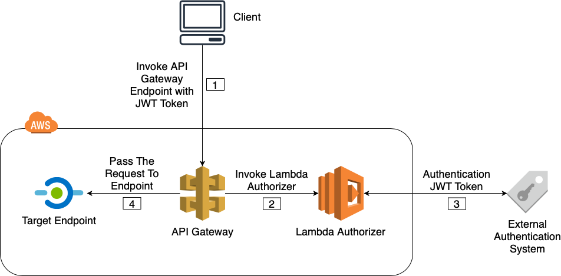
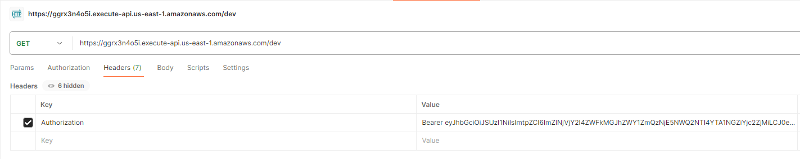

# InvestWhere API Backend

This service is designed for deployment on **AWS Lambda** using Zappa, and includes API Gateway authorization through Firebase Authentication with JWT _(JSON Web Tokens)_ .

## Flow and Architecture 

Here is a architecture diagram for the Lambda flow.
1. Usert invokes an API Gateway endpoint, including a Firebase JWT token in the `Authorization` header.
2. AWS's API Gateway invokes our Lambda Authorizer, which is our [firebase_authorizer.py](https://github.com/UdhayaShan1/investwhere-backend/blob/master/authorizer-package/firebase_authorizer.py).
3. The Lambda Authorizer decodes and verifies the JWT using Firebase’s public keys.
4. If unauthorized, error is thrown
5. If authorized, API Gateway forwards the request to the target endpoint (such as another Lambda function running the Flask app).

 Image Credits: [https://medium.com/@sumindaniro/secure-aws-api-gateway-using-a-lambda-authorizer-40a1da825b16](https://medium.com/@sumindaniro/secure-aws-api-gateway-using-a-lambda-authorizer-40a1da825b16)



## Deploying to AWS Lambda

Highly recommended to [start by setting up your AWS credentials](https://www.youtube.com/watch?v=jCHOsMPbcV0&ab_channel=BeABetterDev)

### Flask API

1. Clone the repository
`git clone https://github.com/UdhayaShan1/investwhere-backend.git`
2. Create a virtual environment:

    ```bash
    python -m venv venv
    source venv/Scripts/activate  # On Windows
    venv\Scripts\activate # On Powershell/VS Code
    ```
3. Install dependencies: `pip install -r requirements.txt`
4. Create .env file with OPENAI_API_KEY as needed 
5. Run zappa commands and deploy `zappa deploy dev`

However you likely may want to create your own config so delete `zappa_settings.json` and run `zappa init` first.

### Authorizer
1. Copy `serviceAccountKey.json` from Firebase into `authorizer-package` folder. This is important for JWT verification as it stores your private keys.
2. In File Explorer, zip all the contents in `authorizer-package`
3. Create a AWS Lambda functions and upload this zip file.
4. Change the handler to `firebase_authorizer.lambda_handler`
5. Create new Authorizer in API Gateway and use Header for Identity source type. 
6. Attach this authorizer to your APIs and redeploy API.

## Request Example
Ensure Authorization is added in header with Value `Bearer ${token}`



You should see **Lambda Hello World** as response.